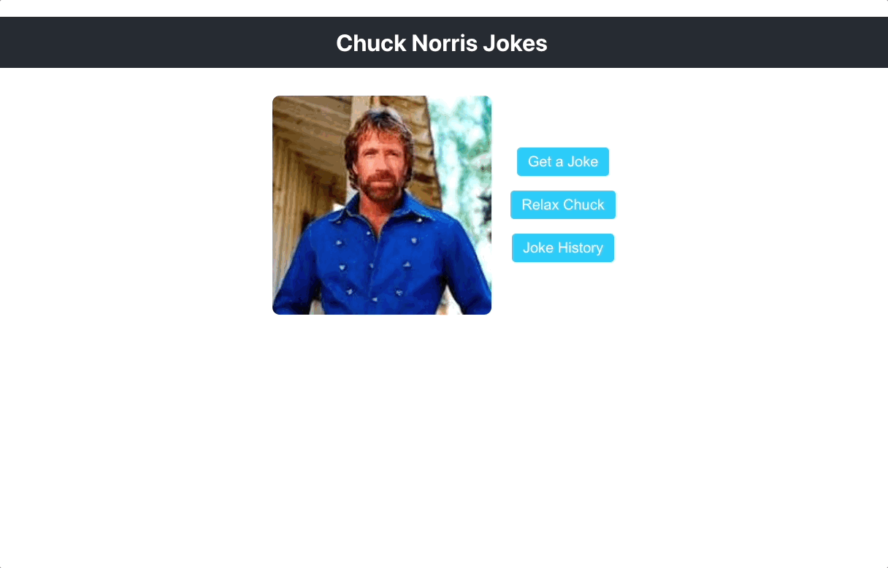

# 🤠 Chuck Norris Quotes

A fun and simple React application that fetches and displays random Chuck Norris jokes. Built in one day to practice API consumption and bring a few laughs.

## Features

- **Get a Random Joke**: Fetch a new random Chuck Norris joke with the click of a button.
- **Save Jokes**: Save your favorite jokes to a list for later viewing.
- **Delete Saved Jokes**: Remove any joke from your saved list.
- **Relax Chuck**: A special feature that changes Chuck Norris's image to something more relaxed.

## Usage

1. **Get a Joke**:  
   Click the **"Get Joke"** button to fetch a new random joke.

2. **Save a Joke**:  
   After fetching a joke, click the **"Save Joke"** button to add it to your saved jokes list.

3. **View Saved Jokes**:  
   Scroll down to see your list of saved jokes.

4. **Delete a Joke**:  
   Click the **"Delete"** button next to any saved joke to remove it from the list.

5. **Relax Chuck**:  
   Click the **"Relax Chuck"** button to see a more light-hearted image of Chuck Norris.

## Installation
1. Clone this repo
2. npm install
3. npm start

## 📧 Contact
 **Email**: jim.macur@gmail.com  

 
 
